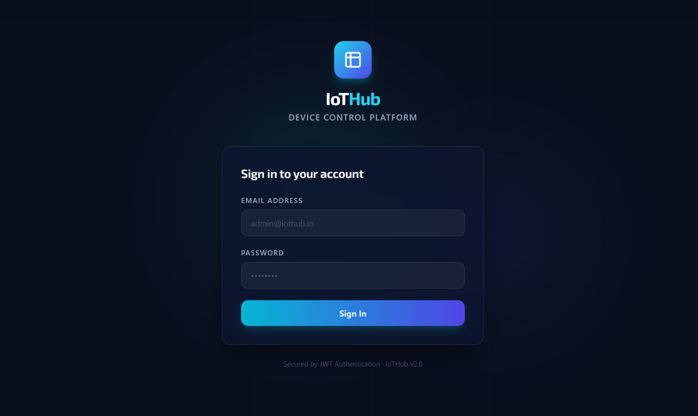
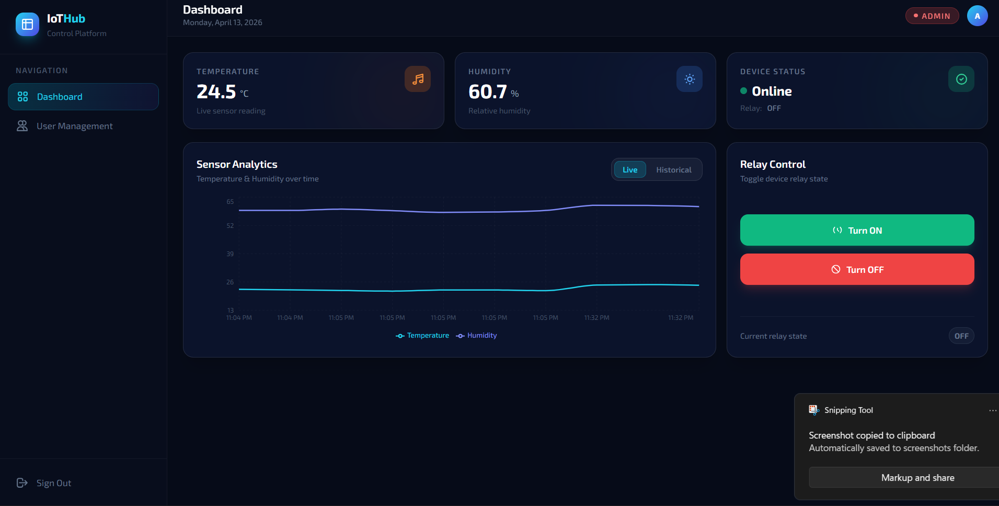
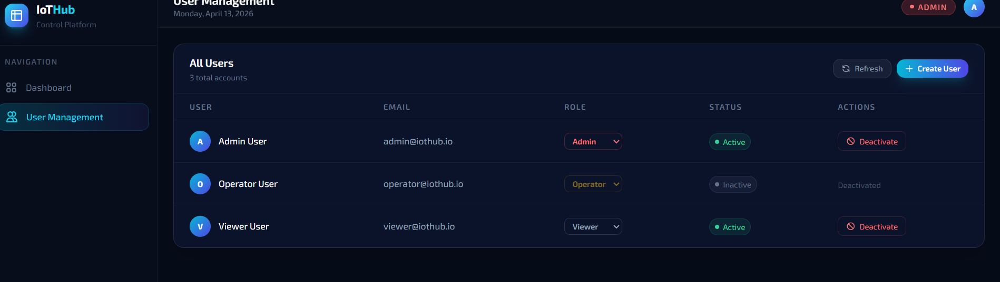

# 🚀 IoT Dashboard System

A full-stack IoT Dashboard for real-time monitoring and control of devices, built using React, Node.js, and MongoDB.

---

## 📌 Overview

This project demonstrates a scalable IoT system that enables:

- 📊 Real-time monitoring of sensor data (Temperature & Humidity)
- 🔐 Secure authentication using JWT
- 🧑‍💻 Role-Based Access Control (Admin / Operator / Viewer)
- 📈 Interactive data visualization using charts
- 🔌 Remote device control (Relay ON/OFF)

The system is designed to simulate real-world IoT applications and can be extended to integrate with physical devices like ESP32.

---

## 🏗️ System Architecture
IoT Device (Simulated)
↓
Node.js Backend (Express API)
↓
MongoDB Database
↓
React Frontend Dashboard

---

## ⚙️ Tech Stack

### 🔹 Frontend
- React.js (Vite)
- Tailwind CSS
- Recharts
- Axios

### 🔹 Backend
- Node.js
- Express.js
- MongoDB (Mongoose)

### 🔐 Authentication
- JSON Web Token (JWT)

---

## ✨ Features

### 🔐 Authentication
- User Registration & Login
- Secure password hashing
- JWT-based session handling

### 🧑‍💻 Role-Based Access
| Role     | Permissions              |
|----------|--------------------------|
| Admin    | Full access              |
| Operator | Control + View           |
| Viewer   | View only                |

---

### 📊 Dashboard
- Live Temperature & Humidity
- Device Status (Online/Offline)
- Auto-refresh every 5 seconds

---

### 📈 Data Visualization
- Real-time charts using Recharts
- Historical trend tracking

---

### 🔌 Device Control
- Relay ON/OFF functionality
- Restricted based on user roles

---

## 🔗 API Endpoints
POST /api/auth/register
POST /api/auth/login

### Device

GET /api/device/data
POST /api/device/relay

### Users (Admin Only)

GET /api/users
PUT /api/users/:id
PUT /api/users/deactivate/:id

---
## 🖼️ Screenshots

### 🔐 Login Page

### 📊 Dashboard

### 📈 User Management

---

## 🛠️ Setup Instructions

### 1. Clone Repository
git clone https://github.com/BinaryCoder30/iot-dashboard-anedya.git
cd iot-dashboard-anedya

2. Backend Setup
cd backend
npm install

Create .env file:

PORT=5000
MONGO_URI=mongodb://127.0.0.1:27017/iot_dashboard
JWT_SECRET=your_secret_key

Run server:

node server.js
3. Frontend Setup
cd frontend
npm install
npm run dev
🔮 Future Enhancements
Integration with ESP32 / real IoT devices
MQTT-based communication
Cloud deployment (AWS / Firebase)
AI-based anomaly detection
Mobile app version
🌐 Relevance to IoT Platforms

This system can be extended and integrated with platforms like Anedya IoT Cloud for scalable device communication, monitoring, and cloud-based IoT management.

👨‍💻 Author

Nimish Soneji
📧 nimishsoneji@gmail.com

🎓 Institute of Infrastructure, Technology, Research And Management

